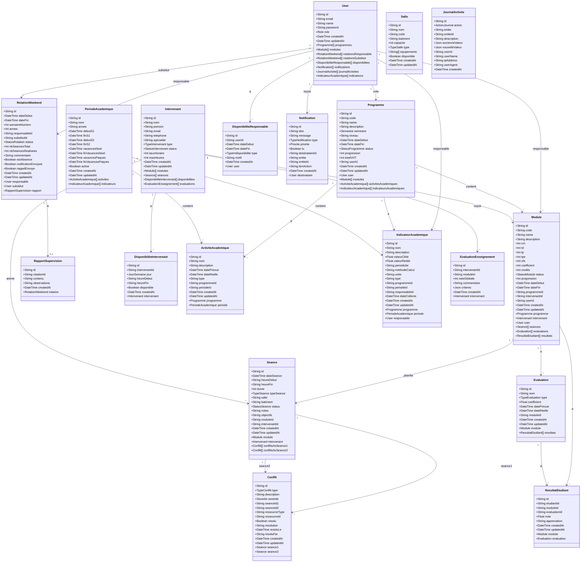

# Diagramme de Classes UML - BEM Planning Backend

## Vue d'ensemble

Ce document présente le diagramme de classes du projet BEM Planning Backend, une application NestJS pour la gestion de planification académique.

---

## Diagramme de Classes (Mermaid)



---

## Diagramme de Classes (PlantUML)

```plantuml
@startuml BEM-Planning-Classes

!theme plain
skinparam classAttributeIconSize 0
skinparam classFontSize 12
skinparam classAttributeFontSize 10

' ==================== ENUMS ====================

enum Role {
    ADMIN
    COORDINATOR
    TEACHER
}

enum Semestre {
    SEMESTRE_1
    SEMESTRE_2
    SEMESTRE_3
    SEMESTRE_4
    SEMESTRE_5
    SEMESTRE_6
}

enum StatusProgramme {
    PLANIFIE
    EN_COURS
    TERMINE
    SUSPENDU
    ANNULE
}

enum StatusModule {
    PLANIFIE
    EN_COURS
    TERMINE
    REPORTE
    ANNULE
}

enum StatusSeance {
    PLANIFIE
    CONFIRME
    EN_COURS
    TERMINE
    REPORTE
    ANNULE
}

enum TypeSeance {
    CM
    TD
    TP
    EXAMEN
    RATTRAPAGE
}

enum TypeConflit {
    INTERVENANT_DOUBLE_BOOKING
    SALLE_DOUBLE_BOOKING
    CHEVAUCHEMENT_HORAIRE
    SURCHARGE_INTERVENANT
}

enum Severite {
    BASSE
    MOYENNE
    HAUTE
    CRITIQUE
}

enum StatusRotation {
    PLANIFIE
    CONFIRME
    EN_COURS
    TERMINE
    ABSENT
    ANNULE
}

enum TypeNotification {
    MODIFICATION_PLANNING
    CONFLIT_DETECTE
    MODULE_SANS_INTERVENANT
    RAPPEL_SEANCE
    ROTATION_WEEKEND
    ABSENCE_DECLAREE
    SYSTEME
}

enum Priorite {
    BASSE
    NORMALE
    HAUTE
    URGENTE
}

enum ActionJournal {
    CREATION
    MODIFICATION
    SUPPRESSION
    CONNEXION
    DECONNEXION
    PLANIFICATION_AUTO
    RESOLUTION_CONFLIT
    ENVOI_NOTIFICATION
}

enum TypeIntervenant {
    PERMANENT
    VACATAIRE
    INVITE
}

enum StatusIntervenant {
    ACTIF
    INACTIF
    EN_CONGE
}

enum TypeSalle {
    AMPHI
    SALLE_COURS
    SALLE_TP
    LABORATOIRE
    SALLE_REUNION
}

enum JourSemaine {
    LUNDI
    MARDI
    MERCREDI
    JEUDI
    VENDREDI
    SAMEDI
    DIMANCHE
}

enum TypeEvaluation {
    CONTROLE_CONTINU
    EXAMEN_PARTIEL
    EXAMEN_FINAL
    TP_NOTE
    PROJET
}

' ==================== CLASSES PRINCIPALES ====================

class User {
    +id: String <<PK>>
    +email: String <<unique>>
    +name: String
    +password: String
    +role: Role
    +createdAt: DateTime
    +updatedAt: DateTime
}

class Programme {
    +id: String <<PK>>
    +code: String <<unique>>
    +name: String
    +description: String
    +semestre: Semestre
    +niveau: String
    +dateDebut: DateTime
    +dateFin: DateTime
    +status: StatusProgramme
    +progression: Int
    +totalVHT: Int
    +userId: String <<FK>>
    +createdAt: DateTime
    +updatedAt: DateTime
}

class Module {
    +id: String <<PK>>
    +code: String <<unique>>
    +name: String
    +description: String
    +cm: Int
    +td: Int
    +tp: Int
    +tpe: Int
    +vht: Int
    +coefficient: Int
    +credits: Int
    +status: StatusModule
    +progression: Int
    +dateDebut: DateTime
    +dateFin: DateTime
    +programmeId: String <<FK>>
    +intervenantId: String <<FK>>
    +userId: String <<FK>>
    +createdAt: DateTime
    +updatedAt: DateTime
}

class Intervenant {
    +id: String <<PK>>
    +nom: String
    +prenom: String
    +email: String <<unique>>
    +telephone: String
    +specialite: String
    +type: TypeIntervenant
    +status: StatusIntervenant
    +tauxHoraire: Int
    +maxHeures: Int
    +createdAt: DateTime
    +updatedAt: DateTime
}

class Seance {
    +id: String <<PK>>
    +dateSeance: DateTime
    +heureDebut: String
    +heureFin: String
    +duree: Int
    +typeSeance: TypeSeance
    +salle: String
    +batiment: String
    +status: StatusSeance
    +notes: String
    +objectifs: String
    +moduleId: String <<FK>>
    +intervenantId: String <<FK>>
    +createdAt: DateTime
    +updatedAt: DateTime
}

class Salle {
    +id: String <<PK>>
    +nom: String
    +code: String <<unique>>
    +batiment: String
    +capacite: Int
    +type: TypeSalle
    +equipements: String[]
    +disponible: Boolean
    +createdAt: DateTime
    +updatedAt: DateTime
}

class Conflit {
    +id: String <<PK>>
    +type: TypeConflit
    +description: String
    +severite: Severite
    +seanceId1: String <<FK>>
    +seanceId2: String <<FK>>
    +ressourceType: String
    +ressourceId: String
    +resolu: Boolean
    +resolution: String
    +resoluLe: DateTime
    +resoluPar: String
    +createdAt: DateTime
    +updatedAt: DateTime
}

' ==================== ROTATION & DISPONIBILITÉS ====================

class RotationWeekend {
    +id: String <<PK>>
    +dateDebut: DateTime
    +dateFin: DateTime
    +semaineNumero: Int
    +annee: Int
    +responsableId: String <<FK>>
    +substitutId: String <<FK>>
    +status: StatusRotation
    +nbSeancesTotal: Int
    +nbSeancesRealisees: Int
    +commentaire: String
    +estAbsence: Boolean
    +notificationEnvoyee: Boolean
    +rappelEnvoye: Boolean
    +createdAt: DateTime
    +updatedAt: DateTime
}

class RapportSupervision {
    +id: String <<PK>>
    +rotationId: String <<FK>>
    +contenu: String
    +observations: String
    +createdAt: DateTime
}

class DisponibiliteIntervenant {
    +id: String <<PK>>
    +intervenantId: String <<FK>>
    +jour: JourSemaine
    +heureDebut: String
    +heureFin: String
    +disponible: Boolean
    +createdAt: DateTime
}

class DisponibiliteResponsable {
    +id: String <<PK>>
    +userId: String <<FK>>
    +dateDebut: DateTime
    +dateFin: DateTime
    +type: String
    +motif: String
    +createdAt: DateTime
}

' ==================== NOTIFICATIONS & JOURNAL ====================

class Notification {
    +id: String <<PK>>
    +titre: String
    +message: String
    +type: TypeNotification
    +priorite: Priorite
    +lu: Boolean
    +destinataireId: String <<FK>>
    +entite: String
    +entiteId: String
    +lienAction: String
    +createdAt: DateTime
}

class JournalActivite {
    +id: String <<PK>>
    +action: ActionJournal
    +entite: String
    +entiteId: String
    +description: String
    +ancienneValeur: Json
    +nouvelleValeur: Json
    +userId: String
    +userName: String
    +ipAddress: String
    +userAgent: String
    +createdAt: DateTime
}

' ==================== ACADÉMIQUE ====================

class PeriodeAcademique {
    +id: String <<PK>>
    +nom: String
    +annee: String
    +debutS1: DateTime
    +finS1: DateTime
    +debutS2: DateTime
    +finS2: DateTime
    +vacancesNoel: DateTime
    +finVacancesNoel: DateTime
    +vacancesPaques: DateTime
    +finVacancesPaques: DateTime
    +active: Boolean
    +createdAt: DateTime
    +updatedAt: DateTime
}

class ActiviteAcademique {
    +id: String <<PK>>
    +nom: String
    +description: String
    +datePrevue: DateTime
    +dateReelle: DateTime
    +type: String
    +programmeId: String <<FK>>
    +periodeId: String <<FK>>
    +createdAt: DateTime
    +updatedAt: DateTime
}

class IndicateurAcademique {
    +id: String <<PK>>
    +nom: String
    +description: String
    +valeurCible: Float
    +valeurReelle: Float
    +periodicite: String
    +methodeCalcul: String
    +unite: String
    +type: String
    +programmeId: String <<FK>>
    +periodeId: String <<FK>>
    +responsableId: String <<FK>>
    +dateCollecte: DateTime
    +createdAt: DateTime
    +updatedAt: DateTime
}

' ==================== ÉVALUATIONS ====================

class Evaluation {
    +id: String <<PK>>
    +nom: String
    +type: TypeEvaluation
    +coefficient: Float
    +datePrevue: DateTime
    +dateReelle: DateTime
    +moduleId: String <<FK>>
    +createdAt: DateTime
    +updatedAt: DateTime
}

class ResultatEtudiant {
    +id: String <<PK>>
    +etudiantId: String
    +moduleId: String <<FK>>
    +evaluationId: String <<FK>>
    +note: Float
    +appreciation: String
    +createdAt: DateTime
    +updatedAt: DateTime
}

class EvaluationEnseignement {
    +id: String <<PK>>
    +intervenantId: String <<FK>>
    +moduleId: String
    +noteGlobale: Int
    +commentaire: String
    +criteres: Json
    +createdAt: DateTime
}

' ==================== RELATIONS ====================

User "1" --o "*" Programme : crée
User "1" --o "*" Module : responsable
User "1" --o "*" RotationWeekend : responsable
User "1" --o "*" RotationWeekend : substitut
User "1" --o "*" Notification : reçoit
User "1" --o "*" DisponibiliteResponsable : déclare
User "1" --o "*" IndicateurAcademique : responsable

Programme "1" --* "*" Module : contient
Programme "1" --o "*" ActiviteAcademique : planifie
Programme "1" --o "*" IndicateurAcademique : mesure

Module "1" --* "*" Seance : planifie
Module "1" --o "*" Evaluation : évalue
Module "1" --o "*" ResultatEtudiant : résultats

Intervenant "1" --o "*" Module : enseigne
Intervenant "1" --o "*" Seance : anime
Intervenant "1" --o "*" DisponibiliteIntervenant : disponibilités
Intervenant "1" --o "*" EvaluationEnseignement : évalué

Seance "*" --o "0..1" Conflit : impliquée
Seance "*" --o "0..1" Conflit : impliquée2

RotationWeekend "1" --o "0..1" RapportSupervision : rapport

PeriodeAcademique "1" --o "*" ActiviteAcademique : contient
PeriodeAcademique "1" --o "*" IndicateurAcademique : mesure

Evaluation "1" --o "*" ResultatEtudiant : résultats

@enduml
```



---

## Diagramme Textuel ASCII

```
┌─────────────────────────────────────────────────────────────────────────────────────┐
│                        DIAGRAMME DE CLASSES - BEM PLANNING                          │
└─────────────────────────────────────────────────────────────────────────────────────┘

┌─────────────────────┐         ┌─────────────────────┐         ┌─────────────────────┐
│        USER         │         │      PROGRAMME      │         │       MODULE        │
├─────────────────────┤         ├─────────────────────┤         ├─────────────────────┤
│ +id: String [PK]    │         │ +id: String [PK]    │         │ +id: String [PK]    │
│ +email: String [UQ] │    1    │ +code: String [UQ]  │    1    │ +code: String [UQ]  │
│ +name: String       │────────>│ +name: String       │────────>│ +name: String       │
│ +password: String   │    *    │ +description: String│    *    │ +description: String│
│ +role: Role         │         │ +semestre: Semestre │         │ +cm: Int            │
│ +createdAt: DateTime│         │ +niveau: String     │         │ +td: Int            │
│ +updatedAt: DateTime│         │ +dateDebut: DateTime│         │ +tp: Int            │
├─────────────────────┤         │ +dateFin: DateTime  │         │ +tpe: Int           │
│ Role:               │         │ +status: Status     │         │ +vht: Int           │
│  - ADMIN            │         │ +progression: Int   │         │ +coefficient: Int   │
│  - COORDINATOR      │         │ +totalVHT: Int      │         │ +credits: Int       │
│  - TEACHER          │         │ +userId: String [FK]│         │ +status: Status     │
└─────────────────────┘         └─────────────────────┘         │ +progression: Int   │
         │                                                       │ +programmeId: [FK]  │
         │ 1                                                     │ +intervenantId: [FK]│
         │                                                       │ +userId: String [FK]│
         ▼ *                                                     └─────────────────────┘
┌─────────────────────┐                                                   │
│    NOTIFICATION     │                                                   │ 1
├─────────────────────┤                                                   │
│ +id: String [PK]    │                                                   ▼ *
│ +titre: String      │         ┌─────────────────────┐         ┌─────────────────────┐
│ +message: String    │         │    INTERVENANT      │         │       SEANCE        │
│ +type: TypeNotif    │         ├─────────────────────┤         ├─────────────────────┤
│ +priorite: Priorite │         │ +id: String [PK]    │    1    │ +id: String [PK]    │
│ +lu: Boolean        │         │ +nom: String        │────────>│ +dateSeance: Date   │
│ +destinataireId:[FK]│         │ +prenom: String     │    *    │ +heureDebut: String │
│ +entite: String     │         │ +email: String [UQ] │         │ +heureFin: String   │
│ +entiteId: String   │         │ +telephone: String  │         │ +duree: Int         │
│ +lienAction: String │         │ +specialite: String │         │ +typeSeance: Type   │
│ +createdAt: DateTime│         │ +type: TypeInterv   │         │ +salle: String      │
└─────────────────────┘         │ +status: Status     │         │ +batiment: String   │
                                │ +tauxHoraire: Int   │         │ +status: Status     │
         │                      │ +maxHeures: Int     │         │ +notes: String      │
         │ 1                    └─────────────────────┘         │ +objectifs: String  │
         │                               │                      │ +moduleId: [FK]     │
         ▼ *                             │ 1                    │ +intervenantId: [FK]│
┌─────────────────────┐                  │                      └─────────────────────┘
│  ROTATION_WEEKEND   │                  ▼ *                             │
├─────────────────────┤         ┌─────────────────────┐                  │ 1
│ +id: String [PK]    │         │ DISPO_INTERVENANT   │                  │
│ +dateDebut: DateTime│         ├─────────────────────┤                  ▼ *
│ +dateFin: DateTime  │         │ +id: String [PK]    │         ┌─────────────────────┐
│ +semaineNumero: Int │         │ +intervenantId: [FK]│         │      CONFLIT        │
│ +annee: Int         │         │ +jour: JourSemaine  │         ├─────────────────────┤
│ +responsableId: [FK]│         │ +heureDebut: String │         │ +id: String [PK]    │
│ +substitutId: [FK]  │         │ +heureFin: String   │         │ +type: TypeConflit  │
│ +status: Status     │         │ +disponible: Boolean│         │ +description: String│
│ +nbSeancesTotal: Int│         └─────────────────────┘         │ +severite: Severite │
│ +nbSeancesRealisees │                                         │ +seanceId1: [FK]    │
│ +commentaire: String│                                         │ +seanceId2: [FK]    │
│ +estAbsence: Boolean│                                         │ +resolu: Boolean    │
│ +notifEnvoyee: Bool │                                         │ +resolution: String │
│ +rappelEnvoye: Bool │                                         │ +resoluLe: DateTime │
└─────────────────────┘                                         │ +resoluPar: String  │
         │                                                      └─────────────────────┘
         │ 1
         │
         ▼ 0..1
┌─────────────────────┐         ┌─────────────────────┐         ┌─────────────────────┐
│ RAPPORT_SUPERVISION │         │  JOURNAL_ACTIVITE   │         │       SALLE         │
├─────────────────────┤         ├─────────────────────┤         ├─────────────────────┤
│ +id: String [PK]    │         │ +id: String [PK]    │         │ +id: String [PK]    │
│ +rotationId: [FK]   │         │ +action: Action     │         │ +nom: String        │
│ +contenu: String    │         │ +entite: String     │         │ +code: String [UQ]  │
│ +observations: Str  │         │ +entiteId: String   │         │ +batiment: String   │
│ +createdAt: DateTime│         │ +description: String│         │ +capacite: Int      │
└─────────────────────┘         │ +ancienneValeur:Json│         │ +type: TypeSalle    │
                                │ +nouvelleValeur:Json│         │ +equipements: Str[] │
                                │ +userId: String     │         │ +disponible: Boolean│
                                │ +userName: String   │         └─────────────────────┘
                                │ +ipAddress: String  │
                                │ +userAgent: String  │
                                │ +createdAt: DateTime│
                                └─────────────────────┘


┌─────────────────────┐         ┌─────────────────────┐         ┌─────────────────────┐
│ PERIODE_ACADEMIQUE  │         │ ACTIVITE_ACADEMIQUE │         │INDICATEUR_ACADEMIQUE│
├─────────────────────┤         ├─────────────────────┤         ├─────────────────────┤
│ +id: String [PK]    │    1    │ +id: String [PK]    │         │ +id: String [PK]    │
│ +nom: String        │────────>│ +nom: String        │         │ +nom: String        │
│ +annee: String      │    *    │ +description: String│         │ +description: String│
│ +debutS1: DateTime  │         │ +datePrevue: Date   │         │ +valeurCible: Float │
│ +finS1: DateTime    │         │ +dateReelle: Date   │         │ +valeurReelle: Float│
│ +debutS2: DateTime  │         │ +type: String       │         │ +periodicite: String│
│ +finS2: DateTime    │         │ +programmeId: [FK]  │         │ +methodeCalcul: Str │
│ +vacancesNoel: Date │         │ +periodeId: [FK]    │         │ +unite: String      │
│ +finVacancesNoel    │         └─────────────────────┘         │ +type: String       │
│ +vacancesPaques     │                                         │ +programmeId: [FK]  │
│ +finVacancesPaques  │                                         │ +periodeId: [FK]    │
│ +active: Boolean    │                                         │ +responsableId: [FK]│
└─────────────────────┘                                         │ +dateCollecte: Date │
         │                                                      └─────────────────────┘
         │ 1
         │
         ▼ *
┌─────────────────────┐         ┌─────────────────────┐         ┌─────────────────────┐
│    EVALUATION       │         │  RESULTAT_ETUDIANT  │         │ EVAL_ENSEIGNEMENT   │
├─────────────────────┤         ├─────────────────────┤         ├─────────────────────┤
│ +id: String [PK]    │    1    │ +id: String [PK]    │         │ +id: String [PK]    │
│ +nom: String        │────────>│ +etudiantId: String │         │ +intervenantId: [FK]│
│ +type: TypeEval     │    *    │ +moduleId: [FK]     │         │ +moduleId: String   │
│ +coefficient: Float │         │ +evaluationId: [FK] │         │ +noteGlobale: Int   │
│ +datePrevue: Date   │         │ +note: Float        │         │ +commentaire: String│
│ +dateReelle: Date   │         │ +appreciation: Str  │         │ +criteres: Json     │
│ +moduleId: [FK]     │         │ +createdAt: DateTime│         │ +createdAt: DateTime│
└─────────────────────┘         └─────────────────────┘         └─────────────────────┘


═══════════════════════════════════════════════════════════════════════════════════════
                                    LÉGENDE
═══════════════════════════════════════════════════════════════════════════════════════

    [PK]     = Primary Key (Clé primaire)
    [FK]     = Foreign Key (Clé étrangère)
    [UQ]     = Unique constraint

    ────────>  Association (1 vers *)
        1      Cardinalité "un"
        *      Cardinalité "plusieurs"
      0..1     Cardinalité "zéro ou un"

═══════════════════════════════════════════════════════════════════════════════════════
                              TYPES ÉNUMÉRÉS (ENUMS)
═══════════════════════════════════════════════════════════════════════════════════════

┌────────────────────┐  ┌────────────────────┐  ┌────────────────────┐
│       Role         │  │     Semestre       │  │  StatusProgramme   │
├────────────────────┤  ├────────────────────┤  ├────────────────────┤
│ ADMIN              │  │ SEMESTRE_1         │  │ PLANIFIE           │
│ COORDINATOR        │  │ SEMESTRE_2         │  │ EN_COURS           │
│ TEACHER            │  │ SEMESTRE_3         │  │ TERMINE            │
└────────────────────┘  │ SEMESTRE_4         │  │ SUSPENDU           │
                        │ SEMESTRE_5         │  │ ANNULE             │
┌────────────────────┐  │ SEMESTRE_6         │  └────────────────────┘
│   StatusModule     │  └────────────────────┘
├────────────────────┤                          ┌────────────────────┐
│ PLANIFIE           │  ┌────────────────────┐  │   StatusSeance     │
│ EN_COURS           │  │    TypeSeance      │  ├────────────────────┤
│ TERMINE            │  ├────────────────────┤  │ PLANIFIE           │
│ REPORTE            │  │ CM                 │  │ CONFIRME           │
│ ANNULE             │  │ TD                 │  │ EN_COURS           │
└────────────────────┘  │ TP                 │  │ TERMINE            │
                        │ EXAMEN             │  │ REPORTE            │
┌────────────────────┐  │ RATTRAPAGE         │  │ ANNULE             │
│   TypeConflit      │  └────────────────────┘  └────────────────────┘
├────────────────────┤
│ INTERVENANT_       │  ┌────────────────────┐  ┌────────────────────┐
│   DOUBLE_BOOKING   │  │     Severite       │  │  StatusRotation    │
│ SALLE_             │  ├────────────────────┤  ├────────────────────┤
│   DOUBLE_BOOKING   │  │ BASSE              │  │ PLANIFIE           │
│ CHEVAUCHEMENT_     │  │ MOYENNE            │  │ CONFIRME           │
│   HORAIRE          │  │ HAUTE              │  │ EN_COURS           │
│ SURCHARGE_         │  │ CRITIQUE           │  │ TERMINE            │
│   INTERVENANT      │  └────────────────────┘  │ ABSENT             │
└────────────────────┘                          │ ANNULE             │
                                                └────────────────────┘
┌────────────────────┐  ┌────────────────────┐
│ TypeNotification   │  │     Priorite       │  ┌────────────────────┐
├────────────────────┤  ├────────────────────┤  │  ActionJournal     │
│ MODIFICATION_      │  │ BASSE              │  ├────────────────────┤
│   PLANNING         │  │ NORMALE            │  │ CREATION           │
│ CONFLIT_DETECTE    │  │ HAUTE              │  │ MODIFICATION       │
│ MODULE_SANS_       │  │ URGENTE            │  │ SUPPRESSION        │
│   INTERVENANT      │  └────────────────────┘  │ CONNEXION          │
│ RAPPEL_SEANCE      │                          │ DECONNEXION        │
│ ROTATION_WEEKEND   │  ┌────────────────────┐  │ PLANIFICATION_AUTO │
│ ABSENCE_DECLAREE   │  │  TypeIntervenant   │  │ RESOLUTION_CONFLIT │
│ SYSTEME            │  ├────────────────────┤  │ ENVOI_NOTIFICATION │
└────────────────────┘  │ PERMANENT          │  └────────────────────┘
                        │ VACATAIRE          │
┌────────────────────┐  │ INVITE             │  ┌────────────────────┐
│ StatusIntervenant  │  └────────────────────┘  │   TypeEvaluation   │
├────────────────────┤                          ├────────────────────┤
│ ACTIF              │  ┌────────────────────┐  │ CONTROLE_CONTINU   │
│ INACTIF            │  │    TypeSalle       │  │ EXAMEN_PARTIEL     │
│ EN_CONGE           │  ├────────────────────┤  │ EXAMEN_FINAL       │
└────────────────────┘  │ AMPHI              │  │ TP_NOTE            │
                        │ SALLE_COURS        │  │ PROJET             │
┌────────────────────┐  │ SALLE_TP           │  └────────────────────┘
│   JourSemaine      │  │ LABORATOIRE        │
├────────────────────┤  │ SALLE_REUNION      │
│ LUNDI              │  └────────────────────┘
│ MARDI              │
│ MERCREDI           │
│ JEUDI              │
│ VENDREDI           │
│ SAMEDI             │
│ DIMANCHE           │
└────────────────────┘
```

---

## Relations Principales

| Relation                                 | Type | Description                                    |
| ---------------------------------------- | ---- | ---------------------------------------------- |
| User → Programme                         | 1:N  | Un utilisateur crée plusieurs programmes       |
| User → Module                            | 1:N  | Un utilisateur est responsable de modules      |
| User → RotationWeekend                   | 1:N  | Un utilisateur peut être responsable/substitut |
| User → Notification                      | 1:N  | Un utilisateur reçoit des notifications        |
| Programme → Module                       | 1:N  | Un programme contient plusieurs modules        |
| Programme → ActiviteAcademique           | 1:N  | Un programme a des activités                   |
| Module → Seance                          | 1:N  | Un module a plusieurs séances                  |
| Module → Evaluation                      | 1:N  | Un module a des évaluations                    |
| Intervenant → Module                     | 1:N  | Un intervenant enseigne des modules            |
| Intervenant → Seance                     | 1:N  | Un intervenant anime des séances               |
| Intervenant → DisponibiliteIntervenant   | 1:N  | Disponibilités hebdomadaires                   |
| Seance → Conflit                         | 1:N  | Une séance peut avoir des conflits             |
| RotationWeekend → RapportSupervision     | 1:1  | Un rapport par rotation                        |
| PeriodeAcademique → ActiviteAcademique   | 1:N  | Activités par période                          |
| PeriodeAcademique → IndicateurAcademique | 1:N  | Indicateurs par période                        |
| Evaluation → ResultatEtudiant            | 1:N  | Résultats par évaluation                       |

---

## Services NestJS (Couche Métier)

```
┌─────────────────────────────────────────────────────────────────┐
│                      SERVICES LAYER                             │
├─────────────────────────────────────────────────────────────────┤
│                                                                 │
│  ┌─────────────────┐  ┌─────────────────┐  ┌─────────────────┐ │
│  │   AuthService   │  │ProgrammeService │  │  ModuleService  │ │
│  ├─────────────────┤  ├─────────────────┤  ├─────────────────┤ │
│  │ +validateUser() │  │ +create()       │  │ +create()       │ │
│  │ +login()        │  │ +findAll()      │  │ +findAll()      │ │
│  │ +signup()       │  │ +findOne()      │  │ +findOne()      │ │
│  │ +googleAuth()   │  │ +update()       │  │ +update()       │ │
│  └─────────────────┘  │ +remove()       │  │ +remove()       │ │
│                       └─────────────────┘  └─────────────────┘ │
│                                                                 │
│  ┌─────────────────┐  ┌─────────────────┐  ┌─────────────────┐ │
│  │ SeancesService  │  │PlanningService  │  │IntervenantSvc   │ │
│  ├─────────────────┤  ├─────────────────┤  ├─────────────────┤ │
│  │ +create()       │  │ +generateAuto() │  │ +create()       │ │
│  │ +findAll()      │  │ +getSlots()     │  │ +findAll()      │ │
│  │ +update()       │  │ +detectConflits │  │ +update()       │ │
│  │ +complete()     │  │ +resolveConflit │  │ +getDispos()    │ │
│  └─────────────────┘  └─────────────────┘  └─────────────────┘ │
│                                                                 │
│  ┌─────────────────┐  ┌─────────────────┐  ┌─────────────────┐ │
│  │RotationService  │  │NotificationSvc  │  │ JournalService  │ │
│  ├─────────────────┤  ├─────────────────┤  ├─────────────────┤ │
│  │ +generate()     │  │ +create()       │  │ +log()          │ │
│  │ +declareAbsence │  │ +findAll()      │  │ +getLogs()      │ │
│  │ +terminate()    │  │ +markRead()     │  │ +getStats()     │ │
│  │ +getUpcoming()  │  │ +markAllRead()  │  │ +cleanup()      │ │
│  └─────────────────┘  └─────────────────┘  └─────────────────┘ │
│                                                                 │
│  ┌─────────────────┐  ┌─────────────────┐  ┌─────────────────┐ │
│  │  EmailService   │  │  SallesService  │  │CoordinateurSvc  │ │
│  ├─────────────────┤  ├─────────────────┤  ├─────────────────┤ │
│  │ +sendEmail()    │  │ +create()       │  │ +getProgrammes()│ │
│  │ +sendReminder() │  │ +findAll()      │  │ +getModules()   │ │
│  │ +sendAlert()    │  │ +checkAvail()   │  │ +getDashboard() │ │
│  └─────────────────┘  └─────────────────┘  │ +checkAlerts()  │ │
│                                            └─────────────────┘ │
│                       ┌─────────────────┐                      │
│                       │  PrismaService  │ ◄── Singleton        │
│                       ├─────────────────┤                      │
│                       │ +$connect()     │                      │
│                       │ +$disconnect()  │                      │
│                       │ +onModuleInit() │                      │
│                       └─────────────────┘                      │
└─────────────────────────────────────────────────────────────────┘
```

---

_Document généré automatiquement - BEM Planning Backend_
